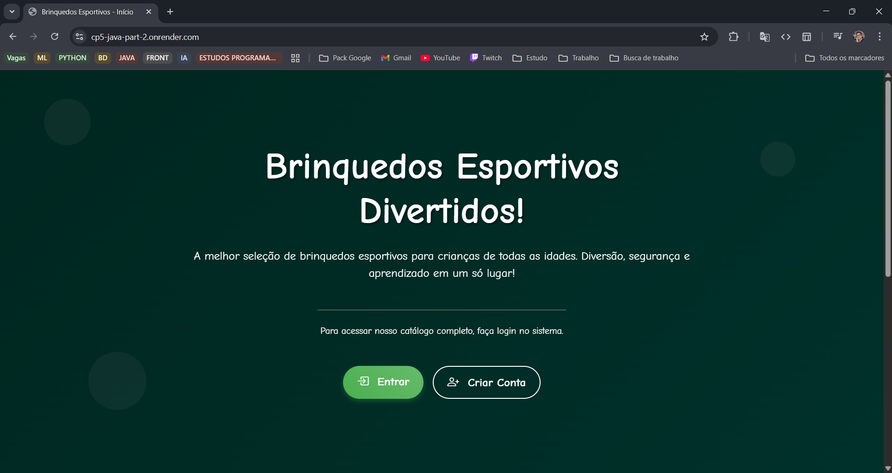
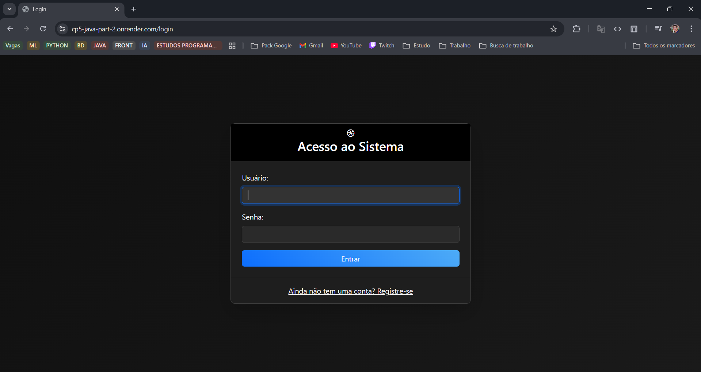
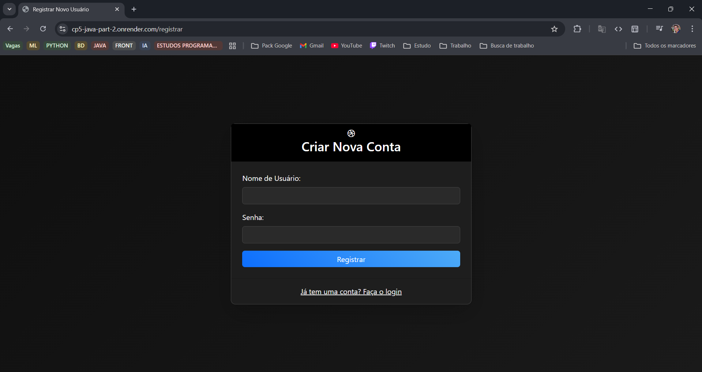
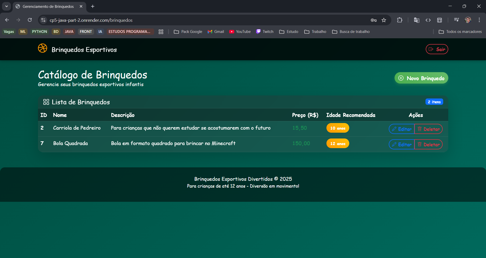
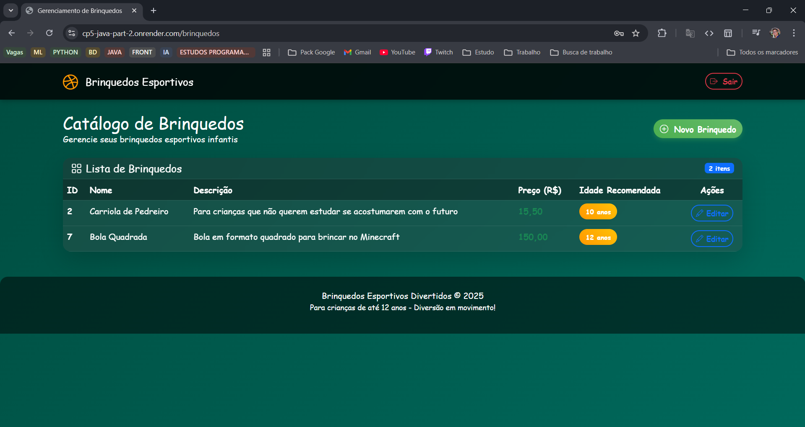
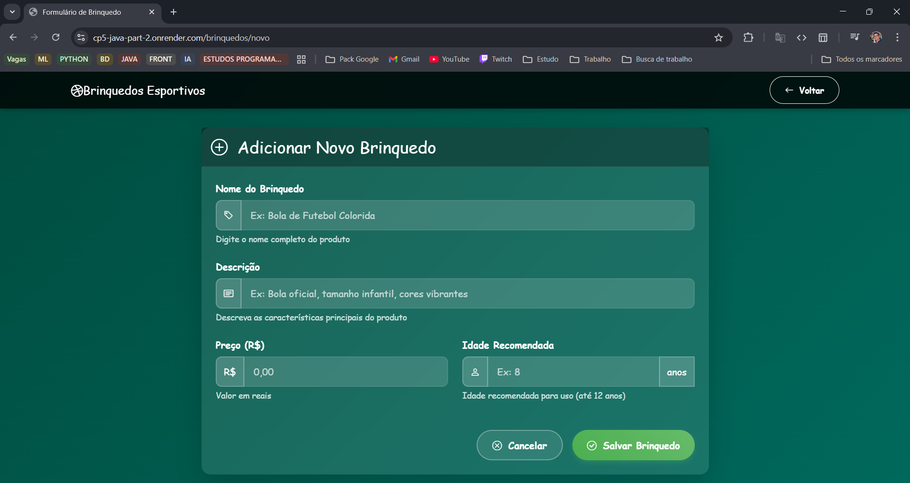
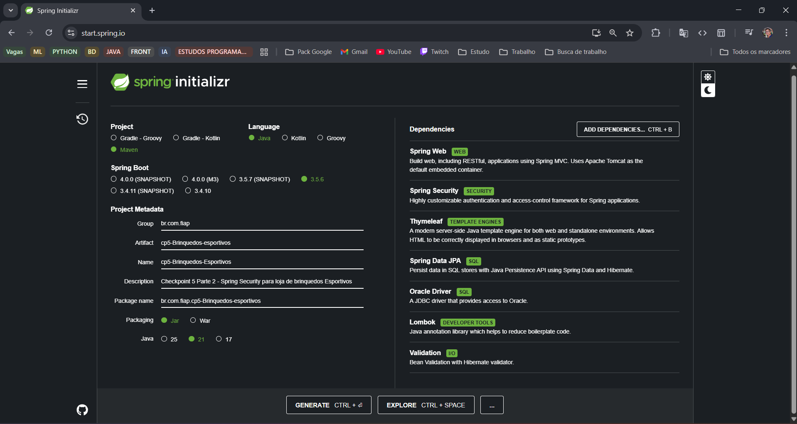

# CP5 - Brinquedos Esportivos (SPORTYS) - Parte 2

### 🚀 Acesse a aplicação em produção aqui: [https://cp5-java-part-2.onrender.com/](https://cp5-java-part-2.onrender.com/)

---

### 👥 Equipe

| Nome | RM |
| :--- | :--- |
| Guilherme Felipe da Silva Souza | 558282 |
| Pablo Lopes Doria de Andrade | 556834 |
| Vinicius Leopoldino de Oliveira | 557047 |

---

## 📖 Descrição do Projeto

Este projeto é a segunda parte do Checkpoint 5 da disciplina de Java Avançado. O objetivo foi desenvolver uma aplicação web completa para a loja de brinquedos esportivos "SPORTYS", com foco na implementação de um sistema robusto de segurança utilizando **Spring Security**.

A aplicação permite o gerenciamento completo de produtos através de operações CRUD (Criar, Ler, Atualizar, Deletar), protegidas por um sistema de autenticação e autorização. A interface foi construída com **Thymeleaf**, seguindo um design moderno e amigável.

## ✨ Funcionalidades

- **CRUD Completo:** Gerenciamento total de brinquedos esportivos.
- **Autenticação:** Sistema de login com tela customizada.
- **Registro de Usuários:** Página de "Sign Up" para novos usuários, com senhas criptografadas usando BCrypt.
- **Autorização por Perfil:** Implementação de dois níveis de acesso:
    - **`ADMIN`**: Acesso total, incluindo a permissão para deletar produtos.
    - **`USER`**: Acesso limitado, pode criar, visualizar e editar produtos, mas não pode deletar.

## Credentials para Teste

Para facilitar a avaliação, foram criados dois usuários de exemplo:

| Perfil | Usuário | Senha |
| :--- | :--- | :--- |
| 👤 **Admin** | `AdminTeste` | `Calma.` |
| 👤 **Usuário**| `UserTeste` | `Tranquilo.`|

---

## 🛠️ Tecnologias Utilizadas

* **Java 21** & **Spring Boot 3.5.6**
* **Spring Security:** Para autenticação e autorização.
* **Spring Data JPA:** Para persistência de dados.
* **Thymeleaf:** Para a camada de visualização (front-end).
* **Maven:** Para gerenciamento de dependências e build do projeto.
* **IDE Utilizada:** IntelliJ
* **Banco de Dados:**
    - **Oracle:** Para desenvolvimento local.
    - **PostgreSQL:** Para o ambiente de produção no Render.

## 📸 Telas da Aplicação

Aqui estão alguns prints que demonstram as principais funcionalidades e o design da aplicação.

#### 1. Tela Inicial


#### 2. Tela de Login


#### 3. Tela de Registro de Novos Usuários


#### 4. Tela Principal - Catálogo de Produtos (Visão do Admin)


#### 5. Tela Principal - Catálogo de Produtos (Visão do Usuario)


#### 6. Formulário de Adição/Edição de Produto


---

## ⚙️ Configuração do Spring Initializr

A imagem abaixo mostra a configuração inicial do projeto no `start.spring.io`, com todas as dependências selecionadas.



---
## Como Executar Localmente

1.  **Clone o repositório:**
    ```bash
    git clone [https://github.com/GuiFelSS/CP5_Java_Part_2.git](https://github.com/GuiFelSS/CP5_Java_Part_2.git)
    cd CP5_Java_Part_2
    ```

2.  **Configure o banco de dados local (`application.properties`):**
    ```properties
    spring.datasource.url=jdbc:oracle:thin:@<SEU_HOST_ORACLE>:<PORTA>:<SID>
    spring.datasource.username=<SEU_USUARIO>
    spring.datasource.password=<SUA_SENHA>
    ```

3.  **Construa e execute o projeto com Maven:**
    ```bash
    mvn spring-boot:run
    ```
    A aplicação estará disponível em `http://localhost:8080`.
